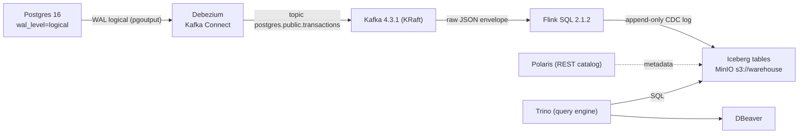

# Data Lakehouse — CDC Pipeline (Docker Compose)

Self-hosted lakehouse: **Postgres → Debezium (CDC) → Kafka → Flink → Iceberg (MinIO + Polaris)**,
queried through **Trino** in DBeaver.

## Architecture



## Stack & versions

| Service | Image / version | Notes |
|---------|-----------------|-------|
| Postgres | `postgres:16` | logical replication `wal_level=logical` |
| Kafka | `apache/kafka:4.3.1` | KRaft single node |
| Debezium | `debezium/connect:3.0.0.Final` | Postgres CDC connector |
| MinIO | `minio/minio:RELEASE.2025-09-07` | object storage, `s3://warehouse` |
| Polaris | `apache/polaris:1.7.0` | Iceberg REST catalog (JDBC metastore in Postgres) |
| Flink | `flink:2.1.2-scala_2.12` | Iceberg + Kafka connectors baked into image |
| Trino | `trinodb/trino:483` | query engine for DBeaver |

Each service lives in its own directory with a `Dockerfile` (Flink/Debezium add external
jars/config). **No named Docker volumes** — state is bind-mounted into the project dir:
`postgres/data`, `kafka/data`, `minio/data`, `polaris-db/data`, `flink/checkpoints`,
`flink/savepoints`.

## Directory layout

```
├── docker-compose.yml      build + orchestrates every service
├── .env                    shared credentials / config
├── postgres/               source DB (init SQL, data)
├── kafka/                  KRaft logs
├── debezium/               connect image + connector registration script
├── flink/
│   ├── Dockerfile          bakes Iceberg/Kafka jars into /opt/flink/lib
│   ├── flink-jars/         connector jars (2.1 / Iceberg 1.11)
│   └── sql/                init.sql (CDC → Iceberg job) + run-job.sh
├── minio/                  server + bucket init script, data
├── polaris/                catalog bootstrap (setup.sh)
├── trino/
│   ├── catalog/            iceberg catalog properties
│   └── views/              transactions_current.sql (latest-state view)
└── scripts/                ops helpers (trino-run, snapshot-to-staging, reconcile, watchdog)
```

## Quick start

```bash
docker compose up -d --build   # build images + start everything
docker compose ps              # wait until all containers are healthy
docker compose exec flink-jobmanager bash /opt/flink-sql/run-job.sh   # submit streaming job
```

## Insert data & watch it flow

```bash
# Insert new rows into Postgres -> they stream down to Iceberg
docker exec -it lakehouse-postgres psql -U postgres -d transactions_db \
  -c "INSERT INTO transactions (user_id, amount, currency, status) VALUES (99, 1234.56, 'USD', 'completed');"

# Confirm CDC landed on Kafka
docker exec -it lakehouse-kafka /opt/kafka/bin/kafka-console-consumer.sh \
  --bootstrap-server localhost:9092 --topic postgres.public.transactions \
  --from-beginning --max-messages 3

# Confirm Debezium connector is RUNNING
curl localhost:8083/connectors/postgres-connector/status | head -c 500

# Row count in Iceberg (via Trino) — append-only CDC log
curl -s -X POST http://localhost:8080/v1/statement \
  -H "X-Trino-User: admin" -H "X-Trino-Catalog: iceberg" \
  -d "SELECT count(*) FROM polaris.transactions_cdc_log"

# Breakdown by CDC operation type (c/u/d = insert/update/delete)
curl -s -X POST http://localhost:8080/v1/statement \
  -H "X-Trino-User: admin" -H "X-Trino-Catalog: iceberg" \
  -d "SELECT __op__, count(*) FROM polaris.transactions_cdc_log GROUP BY __op__"
```

## DBeaver connections

| Target     | Driver | Host | Port | DB/Catalog | User  | Password        | Schema/namespace |
|------------|--------|------|------|-----------|-------|-----------------|------------------|
| Source     | PostgreSQL | `localhost` | `5432` | `transactions_db` | `postgres` | `postgres` | `public` |
| Lakehouse  | Trino  | `localhost` | `8080` | `iceberg` | `admin` | *(blank)*       | `polaris` |

- **Postgres** = source of truth; rows you insert appear in CDC.
- **Trino catalog `iceberg`** reads the Iceberg tables through Polaris (REST catalog) with
  static MinIO S3 credentials for data reads.
  Browse schema `polaris` → table `transactions_cdc_log` (append-only CDC log).

> Iceberg only commits data visible to readers on each Flink checkpoint (default 10s).
> After inserting, allow several seconds before querying.

## Recover a down / gappy stream (diff-based backfill)

When the stream is down or gappy, recovery does **not** reload 100% of the source — it compares
the current state of the CDC log and appends **only** records whose content differs
(SCD2-style), plus deletes. Full design in [`docs/backfill.md`](docs/backfill.md).

```bash
# 1) Automatic (recommended): watchdog detects stream down / checkpoint stall / fail,
#    then runs snapshot → reconcile → restarts the stream from the latest offset.
scripts/watchdog.sh --explain        # health + trigger reason, no recovery
scripts/watchdog.sh                  # check once; recover if a trigger fires
#    cron:  */5 * * * * cd /mnt/d/Projects/my_data_lakehouse && ./scripts/watchdog.sh

# 2) Manual: two steps
scripts/snapshot-to-staging.sh       # Debezium incremental snapshot -> staging (hash in Flink)
DRY_RUN=1 scripts/reconcile.sh       # preview the diff (new/changed/deleted)
scripts/reconcile.sh                 # append the diff to the log

# 3) IMPORTANT after a reconcile: restart the stream from LATEST (not earliest),
#    otherwise it replays the whole topic and duplicates the log.
docker compose exec -T -e STARTUP_MODE=latest flink-jobmanager bash /opt/flink-sql/run-job.sh
```

## Docs per-tech

Chi tiết về cách deploy, version, cấu hình, lý do chọn, `lưu ý config`, các lỗi đã gặp,
lỗi còn tồn đọng, và lỗi liên quan tech khác → xem [`docs/`](docs/README.md).

## Service endpoints

| Service | URL |
|---------|-----|
| Flink web UI | http://localhost:8081 |
| Trino | http://localhost:8080 |
| Debezium REST | http://localhost:8083 |
| MinIO console | http://localhost:9001 (minioadmin/minioadmin) |
| Polaris REST | http://localhost:8181 |
| Kafka | localhost:9092 |
| Postgres | localhost:5432 |

## Useful commands

```bash
# Re-submit the streaming job (jars are baked into the image, SQL is mounted)
docker compose exec flink-jobmanager bash /opt/flink-sql/run-job.sh

# Polaris token flow
curl -s -X POST http://localhost:8181/api/catalog/v1/oauth/tokens \
  --user root:s3cr3t -H "Polaris-Realm: POLARIS" \
  -d 'grant_type=client_credentials' -d 'scope=PRINCIPAL_ROLE:ALL'

# Tear down (keeps bind-mounted data in the project dir)
docker compose down
# Full reset (deletes ./postgres/data, ./kafka/data, ./minio/data)
docker compose down -v
```

## Notes / troubleshooting

- All config lives in `.env`. Restart services after edits.
- First run: Postgres runs `init-db.sql` (creates `transactions` table + 5 sample rows +
  `flink_publication`); `minio-init` creates the bucket; `polaris-bootstrap` (admin-tool)
  creates the Polaris schema + realm in `polaris-db`; `polaris-setup` creates the catalog;
  `debezium-register` posts the Postgres CDC connector config.
- If the Flink job fails on catalog auth, verify Polaris is healthy: `curl localhost:8182/q/health`.
- Trino `iceberg` catalog uses static MinIO S3 keys (Trino-native `s3.*` props, `fs.s3.enabled=true`);
  it does not rely on Polaris vended-credentials. Polaris must be granted `CATALOG_MANAGE_CONTENT` so
  root can create the `polaris` namespace (done by the grant step — see setup).
- Flink Kafka source table must live in the **default (in-memory) catalog**, not the Iceberg one,
  and is qualified as `default_catalog.default_database.cdc_transactions_source` in the `INSERT`;
  otherwise it is treated as an empty Iceberg source and the job finishes immediately.
- The Iceberg sink is **append-only** (`transactions_cdc_log`): every change is a new row carrying
  the CDC system columns `__op__`, `__source_ts__`, `__lsn__`, `__db__`, `__schema__`, `__table__`,
  `__hash__`, `__ingest_ts__`. It is not idempotent, so checkpoints persist to `flink/checkpoints`
  and `run-job.sh` resumes from the latest savepoint (`STARTUP_MODE=latest` skips the topic
  entirely — used after a reconcile).
- Per-service builds are cached; rebuild only what changed: `docker compose build flink`.