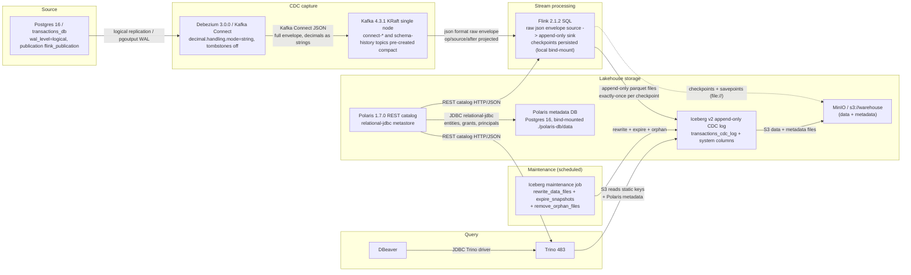

# Lakehouse Architecture — Postgres → Debezium → Kafka → Flink → Iceberg (MinIO + Polaris) → Trino

Self-hosted streaming CDC lakehouse PoC.

## 1. Architecture



## 2. Polaris catalog — PostgreSQL-backed metastore

Polaris (`apache/polaris:1.7.0`) is the Iceberg REST catalog. Its metastore is persisted to a
dedicated PostgreSQL instance (`polaris-db`, bind-mounted at `./polaris-db/data` per the repo's
no-named-volumes convention) via the `relational-jdbc` persistence backend, shipped in the image —
no rebuild required. The instance is **separate** from the source `postgres` service, so a full
source-DB reset cannot silently wipe the catalog.

```yaml
polaris:
  environment:
    POLARIS_BOOTSTRAP_CREDENTIALS: "${POLARIS_REALM},${POLARIS_ROOT_USER},${POLARIS_ROOT_PASSWORD}"
    "polaris.realm-context.realms": "${POLARIS_REALM}"
    POLARIS_PERSISTENCE_TYPE: "relational-jdbc"
    POLARIS_PERSISTENCE_RELATIONAL_JDBC_DATABASE_TYPE: "postgresql"
    QUARKUS_DATASOURCE_JDBC_URL: "jdbc:postgresql://polaris-db:5432/${POLARIS_DB_NAME}"
    QUARKUS_DATASOURCE_USERNAME: "${POLARIS_DB_USER}"
    QUARKUS_DATASOURCE_PASSWORD: "${POLARIS_DB_PASSWORD}"
    POLARIS_SERVER_PORT: "8181"
    AWS_REGION: "${MINIO_REGION}"
    AWS_ACCESS_KEY_ID: "${MINIO_ROOT_USER}"
    AWS_SECRET_ACCESS_KEY: "${MINIO_ROOT_PASSWORD}"
```

The schema does **not** auto-create — Polaris runs no automated migrations. A one-shot
`polaris-bootstrap` container (`apache/polaris-admin-tool:1.7.0`) must run *before* the server, with
the same `relational-jdbc` env vars:

```text
bootstrap --realm=POLARIS --credential=POLARIS,<client-id>,<client-secret>
```

Bootstrap is idempotent and creates the schema (tables `version`, `entities`, `grant_records`,
`principal_authentication_data`, `policy_mapping_record`, `events`, …). Startup order: `polaris-db`
(healthy) → `polaris-bootstrap` (completed) → `polaris` (server) → `polaris-setup` (creates the
catalog + `CATALOG_MANAGE_CONTENT` grant via REST).

Because the metastore lives in Postgres, catalog, namespace, table, principals, roles and grants
survive `docker compose down/up`. Back up `polaris-db` like the source DB, and include
`./polaris-db/data` in any full reset alongside `postgres/data`, `kafka/data` and `minio/data`.

## 3. Iceberg CDC event log (append-only)

Flink reads the **full Debezium JSON envelope** from Kafka using the raw `json` format (not
`debezium-json`, which would consume the envelope internally) and appends every change event to the
append-only Iceberg table `transactions_cdc_log` — no PRIMARY KEY, no `write.upsert.enabled`. Each
row repeats the data columns plus eight system columns, preserving the complete change history.

Source (raw envelope):

```sql
CREATE TABLE cdc_transactions_source (
  `before` ROW<id BIGINT, user_id BIGINT, amount STRING, currency STRING, status STRING,
               created_at TIMESTAMP_LTZ(6), updated_at TIMESTAMP_LTZ(6)>,
  `after`  ROW<id BIGINT, user_id BIGINT, amount STRING, currency STRING, status STRING,
               created_at TIMESTAMP_LTZ(6), updated_at TIMESTAMP_LTZ(6)>,
  `source` ROW<db STRING, `schema` STRING, `table` STRING, ts_ms BIGINT, lsn BIGINT>,
  op       STRING,
  ts_ms    BIGINT
) WITH (
  'connector' = 'kafka',
  'topic'     = 'postgres.public.transactions',
  'properties.bootstrap.servers' = 'kafka:9092',
  'properties.group.id' = 'flink-lakehouse',
  'scan.startup.mode'  = 'earliest-offset',
  'format'    = 'json',
  'json.timestamp-format.standard' = 'ISO-8601',
  'json.ignore-parse-errors' = 'false'
);
```

Sink (append-only, no PK, with system columns):

```sql
CREATE TABLE transactions_cdc_log (
  id              BIGINT,
  user_id         BIGINT,
  amount          DECIMAL(12,2),
  currency        VARCHAR(3),
  status          VARCHAR(20),
  created_at      TIMESTAMP_LTZ(6),
  updated_at      TIMESTAMP_LTZ(6),
  __op__          STRING,
  __source_ts__   TIMESTAMP_LTZ(3),
  __lsn__         BIGINT,
  __db__          STRING,
  __schema__      STRING,
  __table__       STRING,
  __ingest_ts__   TIMESTAMP_LTZ(3)
) WITH ('format-version' = '2');

INSERT INTO transactions_cdc_log
SELECT
  COALESCE(`after`.id, `before`.id)                      AS id,
  COALESCE(`after`.user_id, `before`.user_id)            AS user_id,
  CAST(COALESCE(`after`.amount, `before`.amount) AS DECIMAL(12,2)) AS amount,
  COALESCE(`after`.currency, `before`.currency)          AS currency,
  COALESCE(`after`.status, `before`.status)              AS status,
  COALESCE(`after`.created_at, `before`.created_at)      AS created_at,
  COALESCE(`after`.updated_at, `before`.updated_at)      AS updated_at,
  op                                                     AS __op__,
  TO_TIMESTAMP_LTZ(`source`.ts_ms, 3)                    AS __source_ts__,
  `source`.lsn                                           AS __lsn__,
  `source`.db                                            AS __db__,
  `source`.`schema`                                      AS __schema__,
  `source`.`table`                                       AS __table__,
  TO_TIMESTAMP_LTZ(ts_ms, 3)                             AS __ingest_ts__
FROM default_catalog.default_database.cdc_transactions_source;
```

Append-only keeps the complete change history (audit, time-travel, replay, SCD-type-2): delete
events become *rows* (`__op__ = 'd'`) instead of disappearing, and the write path is simpler and
cheaper (no delete files, no merge-on-read amplification, faster commits).

Because the log is not idempotent and grows without bound, three things follow:

- **Persist Flink checkpoints.** State lives outside the JobManager heap
  (`state.checkpoints.dir`/`state.savepoints.dir`, resumed from a savepoint in `run-job.sh`), so a
  restart re-reads only the uncommitted tail instead of appending duplicates. For the PoC this is a
  bind-mounted `file://` dir — the image lacks the `flink-s3-fs` plugin, so `s3://` state is
  deferred.
- **Deterministic timestamps.** `__source_ts__` is derived from `source.ts_ms` (Postgres commit
  time), never `CURRENT_TIMESTAMP`/`PROCTIME()`, so replays produce identical rows.
- **Current-state view & retention.** The latest state is derived downstream — a batch "latest
  state" view/table or `qualify row_number() over (partition by id order by __lsn__ desc)`. Growth is
  bounded by partitioning on commit day (`days(__source_ts__)`) with scheduled `expire_snapshots` /
  partition-drop retention and Iceberg maintenance (`rewrite_data_files`, `expire_snapshots`,
  `remove_orphan_files`).

## 4. Data model and conventions

- **Table-per-source.** One append-only log table per captured table, named `<table>_cdc_log`, with
  the source columns plus the system columns. A single shared "cdc_all_events" table is rejected —
  it optimizes nothing at PoC scale and makes Trino queries painful.
- **System columns** (lowercase, `__`-delimited): `__op__`, `__source_ts__`, `__lsn__`, `__db__`,
  `__schema__`, `__table__`, `__hash__`, `__ingest_ts__`. (`__scn__` is Oracle's system-change
  number; Postgres uses the log-sequence number `__lsn__` — the same role.) `__hash__` is a
  full-record MD5 computed **only in Flink** (HASH CONTRACT, see `docs/backfill.md`) used by the
  diff-based backfill to append only changed rows without hashing in Trino.
- **Partitioning/retention** (deferred for the PoC): `PARTITIONED BY (days(__source_ts__))` +
  `expire_snapshots` for N days.
- **Connect/Debezium config:** `decimal.handling.mode=string` (exact, works with `schemas.enable=false`);
  `tombstones.on.delete=false` (single `op=d` event, no null rows); no `ExtractNewRecordState` SMT
  (the envelope is the payload).

## 5. Components

| Component | Version / image | Role |
|-----------|-----------------|------|
| PostgreSQL (source) | `postgres:16` | Source of truth; `wal_level=logical`, publication `flink_publication`, table `public.transactions` |
| Debezium | `debezium/connect:3.0.0.Final` | Kafka Connect worker; Postgres CDC via pgoutput; writes full envelope JSON |
| Kafka | `apache/kafka:4.3.1` | KRaft single-node bus; topic `postgres.public.transactions`; internal connect + schema-history topics |
| Flink | `flink:2.1.2-scala_2.12` (+ `iceberg-flink-runtime-2.1-1.11.0`, `iceberg-aws-bundle-1.11.0`, `flink-sql-connector-kafka-5.0.0-2.1`, hadoop-client) | SQL streaming: raw envelope source → append-only Iceberg sink; exactly-once via checkpoint |
| Iceberg | `1.11.0` (format v2) | Table format on MinIO; target table is an append-only CDC log |
| MinIO | `minio/minio:RELEASE.2025-09-07` | S3-compatible object storage; `s3://warehouse` for data + metadata |
| Polaris | `apache/polaris:1.7.0` | Iceberg REST catalog with `relational-jdbc` (Postgres) metastore |
| Polaris metadata DB | `postgres:16` | Persists Polaris entities/grants/principals; bind-mounted `./polaris-db/data` |
| Trino | `trinodb/trino:483` | Query engine; `iceberg` catalog via Polaris REST, static `s3.*` credentials for reads |
| DBeaver | n/a | Client for Trino (lakehouse) and Postgres (source) |

## 6. Production path (beyond the PoC)

- **Kafka:** 3+ node KRaft with controller quorum, `offsets.topic.replication.factor=3`,
  `auto.create.topics.enable=false`, pre-created topics, TLS/SASL.
- **Object storage:** MinIO → managed S3 (or GCS/ADLS via the same Iceberg `S3FileIO`); bucket versioning.
- **Polaris:** dedicated `service_admin`/`catalog_admin` principals + RBAC grants; a Postgres
  (or CockroachDB) backend with backups.
- **Flink:** Application mode + HA, savepoints on object storage (`flink-s3-fs-presto` plugin added),
  RocksDB state backend, checkpoint interval tuned to the SLO.
- **Maintenance:** scheduled Iceberg compaction (`rewrite_data_files`, `rewrite_manifests`,
  `expire_snapshots`, `remove_orphan_files`) + retention.
- **Latency/correctness:** exactly-once per checkpoint (default 10s) sets the visibility floor; for
  the append-only log, dedup is delegated to a downstream batch job keyed on `(db, schema, table, lsn)`.
