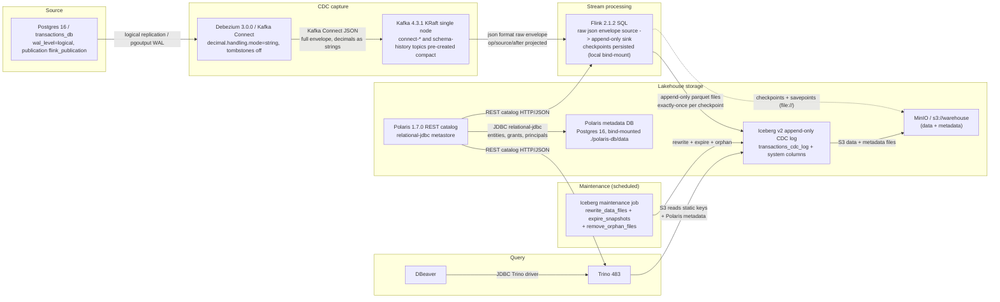

# Kiến trúc Lakehouse — Postgres → Debezium → Kafka → Flink → Iceberg (MinIO + Polaris) → Trino

Lakehouse CDC streaming tự host (PoC).

## 1. Kiến trúc



## 2. Polaris catalog — metastore PostgreSQL

Polaris (`apache/polaris:1.7.0`) là Iceberg REST catalog. Metastore của nó được persist vào một
instance PostgreSQL riêng (`polaris-db`, bind-mount tại `./polaris-db/data` theo quy ước
"không dùng named volume" của repo) qua backend `relational-jdbc` có sẵn trong image — không cần
rebuild. Instance này **tách riêng** khỏi service `postgres` nguồn, để việc reset source DB không
thể vô tình xóa luôn catalog.

```yaml
polaris:
  environment:
    POLARIS_BOOTSTRAP_CREDENTIALS: "${POLARIS_REALM},${POLARIS_ROOT_USER},${POLARIS_ROOT_PASSWORD}"
    "polaris.realm-context.realms": "${POLARIS_REALM}"
    POLARIS_PERSISTENCE_TYPE: "relational-jdbc"
    POLARIS_PERSISTENCE_RELATIONAL_JDBC_DATABASE_TYPE: "postgresql"
    QUARKUS_DATASOURCE_JDBC_URL: "jdbc:postgresql://polaris-db:5432/${POLARIS_DB_NAME}"
    QUARKUS_DATASOURCE_USERNAME: "${POLARIS_DB_USER}"
    QUARKUS_DATASOURCE_PASSWORD: "${POLARIS_DB_PASSWORD}"
    POLARIS_SERVER_PORT: "8181"
    AWS_REGION: "${MINIO_REGION}"
    AWS_ACCESS_KEY_ID: "${MINIO_ROOT_USER}"
    AWS_SECRET_ACCESS_KEY: "${MINIO_ROOT_PASSWORD}"
```

Schema **không** tự tạo — Polaris không chạy migration tự động. Một container one-shot
`polaris-bootstrap` (`apache/polaris-admin-tool:1.7.0`) phải chạy *trước* server, với cùng các biến
env `relational-jdbc`:

```text
bootstrap --realm=POLARIS --credential=POLARIS,<client-id>,<client-secret>
```

Bootstrap là idempotent và tạo schema (các bảng `version`, `entities`, `grant_records`,
`principal_authentication_data`, `policy_mapping_record`, `events`, …). Thứ tự khởi động:
`polaris-db` (healthy) → `polaris-bootstrap` (completed) → `polaris` (server) → `polaris-setup`
(tạo catalog + grant `CATALOG_MANAGE_CONTENT` qua REST).

Vì metastore nằm trong Postgres, catalog, namespace, table, principal, role và grant sống sót qua
`docker compose down/up`. Backup `polaris-db` như source DB, và đưa `./polaris-db/data` vào mọi thao
tác reset toàn bộ cùng với `postgres/data`, `kafka/data` và `minio/data`.

## 3. Iceberg CDC event log (append-only)

Flink đọc **toàn bộ envelope JSON của Debezium** từ Kafka bằng format `json` thô (không phải
`debezium-json`, vì format đó tiêu thụ envelope bên trong) và append mỗi change event vào bảng
Iceberg append-only `transactions_cdc_log` — không PRIMARY KEY, không `write.upsert.enabled`. Mỗi
dòng lặp lại các cột dữ liệu cộng thêm tám cột hệ thống, giữ nguyên toàn bộ lịch sử thay đổi.

Source (envelope thô):

```sql
CREATE TABLE cdc_transactions_source (
  `before` ROW<id BIGINT, user_id BIGINT, amount STRING, currency STRING, status STRING,
               created_at TIMESTAMP_LTZ(6), updated_at TIMESTAMP_LTZ(6)>,
  `after`  ROW<id BIGINT, user_id BIGINT, amount STRING, currency STRING, status STRING,
               created_at TIMESTAMP_LTZ(6), updated_at TIMESTAMP_LTZ(6)>,
  `source` ROW<db STRING, `schema` STRING, `table` STRING, ts_ms BIGINT, lsn BIGINT>,
  op       STRING,
  ts_ms    BIGINT
) WITH (
  'connector' = 'kafka',
  'topic'     = 'postgres.public.transactions',
  'properties.bootstrap.servers' = 'kafka:9092',
  'properties.group.id' = 'flink-lakehouse',
  'scan.startup.mode'  = 'earliest-offset',
  'format'    = 'json',
  'json.timestamp-format.standard' = 'ISO-8601',
  'json.ignore-parse-errors' = 'false'
);
```

Sink (append-only, không PK, có các cột hệ thống):

```sql
CREATE TABLE transactions_cdc_log (
  id              BIGINT,
  user_id         BIGINT,
  amount          DECIMAL(12,2),
  currency        VARCHAR(3),
  status          VARCHAR(20),
  created_at      TIMESTAMP_LTZ(6),
  updated_at      TIMESTAMP_LTZ(6),
  __op__          STRING,
  __source_ts__   TIMESTAMP_LTZ(3),
  __lsn__         BIGINT,
  __db__          STRING,
  __schema__      STRING,
  __table__       STRING,
  __ingest_ts__   TIMESTAMP_LTZ(3)
) WITH ('format-version' = '2');

INSERT INTO transactions_cdc_log
SELECT
  COALESCE(`after`.id, `before`.id)                      AS id,
  COALESCE(`after`.user_id, `before`.user_id)            AS user_id,
  CAST(COALESCE(`after`.amount, `before`.amount) AS DECIMAL(12,2)) AS amount,
  COALESCE(`after`.currency, `before`.currency)          AS currency,
  COALESCE(`after`.status, `before`.status)              AS status,
  COALESCE(`after`.created_at, `before`.created_at)      AS created_at,
  COALESCE(`after`.updated_at, `before`.updated_at)      AS updated_at,
  op                                                     AS __op__,
  TO_TIMESTAMP_LTZ(`source`.ts_ms, 3)                    AS __source_ts__,
  `source`.lsn                                           AS __lsn__,
  `source`.db                                            AS __db__,
  `source`.`schema`                                      AS __schema__,
  `source`.`table`                                       AS __table__,
  TO_TIMESTAMP_LTZ(ts_ms, 3)                             AS __ingest_ts__
FROM default_catalog.default_database.cdc_transactions_source;
```

Append-only giữ nguyên toàn bộ lịch sử thay đổi (audit, time-travel, replay, SCD-type-2): delete
event trở thành *một dòng* (`__op__ = 'd'`) thay vì biến mất, và write path đơn giản, chi phí thấp
hơn (không delete file, không merge-on-read amplification, commit nhanh hơn).

Vì log này không idempotent và tăng trưởng không giới hạn, ba điều sau là bắt buộc:

- **Persist Flink checkpoint.** State nằm ngoài heap của JobManager
  (`state.checkpoints.dir`/`state.savepoints.dir`, resume từ savepoint trong `run-job.sh`), để khi
  restart chỉ đọc lại phần đuôi chưa commit thay vì append trùng lặp. Với PoC, đây là thư mục
  `file://` bind-mount — image chưa có plugin `flink-s3-fs`, nên state dạng `s3://` để sau.
- **Timestamp xác định.** `__source_ts__` lấy từ `source.ts_ms` (thời điểm commit của Postgres),
  không dùng `CURRENT_TIMESTAMP`/`PROCTIME()`, để khi replay cho ra các dòng giống hệt.
- **View trạng thái hiện tại & retention.** Trạng thái mới nhất được tạo downstream — một view/bảng
  "latest state" hoặc `qualify row_number() over (partition by id order by __lsn__ desc)`. Tăng
  trưởng được giới hạn bằng partition theo ngày commit (`days(__source_ts__)`) với
  `expire_snapshots`/partition-drop định kỳ và maintenance Iceberg (`rewrite_data_files`,
  `expire_snapshots`, `remove_orphan_files`).

## 4. Mô hình dữ liệu và quy ước

- **Một bảng cho mỗi bảng nguồn.** Một bảng log append-only cho mỗi bảng Postgres, đặt tên
  `<table>_cdc_log`, gồm các cột nguồn + các cột hệ thống. Một bảng chung "cdc_all_events" bị bác bỏ
  — không tối ưu gì ở quy mô PoC và khiến truy vấn Trino vất vả.
- **Các cột hệ thống** (chữ thường, phân cách bằng `__`): `__op__`, `__source_ts__`, `__lsn__`,
  `__db__`, `__schema__`, `__table__`, `__hash__`, `__ingest_ts__`. (`__scn__` là system-change
  number của Oracle; Postgres dùng log-sequence number `__lsn__` — cùng vai trò.) `__hash__` là
  MD5 full-record **chỉ tính ở Flink** (HASH CONTRACT, xem `docs/backfill.md`) dùng cho backfill
  diff — append chỉ record đổi, không hash ở Trino.
- **Partition/retention** (tạm hoãn cho PoC): `PARTITIONED BY (days(__source_ts__))` +
  `expire_snapshots` theo N ngày.
- **Cấu hình Connect/Debezium:** `decimal.handling.mode=string` (chính xác, hợp với
  `schemas.enable=false`); `tombstones.on.delete=false` (một event `op=d`, không có dòng null);
  không dùng SMT `ExtractNewRecordState` (envelope chính là payload).

## 5. Components

| Component | Version / image | Vai trò |
|-----------|-----------------|------|
| PostgreSQL (source) | `postgres:16` | Nguồn sự thật; `wal_level=logical`, publication `flink_publication`, bảng `public.transactions` |
| Debezium | `debezium/connect:3.0.0.Final` | Kafka Connect worker; Postgres CDC qua pgoutput; ghi envelope JSON đầy đủ |
| Kafka | `apache/kafka:4.3.1` | Bus KRaft single-node; topic `postgres.public.transactions`; các topic nội bộ của connect + schema-history |
| Flink | `flink:2.1.2-scala_2.12` (+ `iceberg-flink-runtime-2.1-1.11.0`, `iceberg-aws-bundle-1.11.0`, `flink-sql-connector-kafka-5.0.0-2.1`, hadoop-client) | SQL streaming: source envelope thô → sink Iceberg append-only; exactly-once qua checkpoint |
| Iceberg | `1.11.0` (format v2) | Định dạng bảng trên MinIO; bảng mục tiêu là CDC log append-only |
| MinIO | `minio/minio:RELEASE.2025-09-07` | Object storage tương thích S3; `s3://warehouse` cho data + metadata |
| Polaris | `apache/polaris:1.7.0` | Iceberg REST catalog với metastore `relational-jdbc` (Postgres) |
| Polaris metadata DB | `postgres:16` | Persist entities/grants/principals của Polaris; bind-mount `./polaris-db/data` |
| Trino | `trinodb/trino:483` | Query engine; catalog `iceberg` qua Polaris REST, static credential `s3.*` cho việc đọc |
| DBeaver | n/a | Client cho Trino (lakehouse) và Postgres (source) |

## 6. Lộ trình production (ngoài PoC)

- **Kafka:** KRaft 3+ node có controller quorum, `offsets.topic.replication.factor=3`,
  `auto.create.topics.enable=false`, topic tạo trước, TLS/SASL.
- **Object storage:** MinIO → S3 quản lý (hoặc GCS/ADLS qua cùng interface Iceberg `S3FileIO`);
  bật versioning cho bucket.
- **Polaris:** triển khai thật với principal `service_admin`/`catalog_admin` riêng + RBAC grant;
  backend Postgres (hoặc CockroachDB) có backup.
- **Flink:** Application mode + HA, savepoint trên object storage (thêm plugin `flink-s3-fs-presto`),
  state backend RocksDB, checkpoint interval theo SLO.
- **Maintenance:** compaction Iceberg định kỳ (`rewrite_data_files`, `rewrite_manifests`,
  `expire_snapshots`, `remove_orphan_files`) + retention.
- **Latency/correctness:** exactly-once theo checkpoint (mặc định 10s) là trần độ trễ hiển thị; với
  log append-only, dedup được ủy cho một batch job downstream khóa theo `(db, schema, table, lsn)`.
