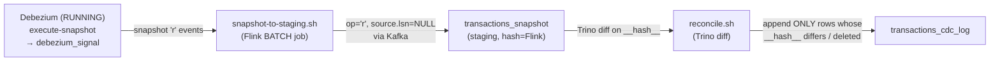

# Backfill & khôi phục CDC — diff-based (SCD2-style)

Khi stream CDC bị rớt / gián đoạn, mục tiêu là **không load lại 100% bảng nguồn** mà so sánh
với trạng thái hiện tại của log, **chỉ append những record khác** (SCD2-style diff), kèm xử lý
record bị xóa.

Cơ chế gồm 3 khối:



## 1. Khi nào dùng

| Tình huống | Cách xử lý |
|-----------|------------|
| Flink job tắt ngắn, event còn trong Kafka | Resume từ savepoint — không cần backfill |
| Stream rớt / checkpoints fail, Kafka vẫn giữ event | **Watchdog** (`scripts/watchdog.sh`) tự chạy recovery (tài liệu này) |
| Event đã mất khỏi Kafka, Postgres còn dữ liệu | Incremental snapshot → staging → reconcile (tài liệu này) |
| Replication slot bị drop / WAL recycled | Full re-snapshot (`snapshot.mode=initial`) |

## 2. Ý tưởng

Thay vì đọc hết bảng nguồn rồi ghi đè lại log, ta:

1. Chụp **trạng thái hiện tại** của nguồn qua Debezium **incremental snapshot**
   (`op='r'` events, chạy song song, không khóa bảng) vào bảng staging
   `transactions_snapshot`.
2. **So sánh hash** staging với trạng thái hiện tại của log (`transactions_current`):
   - `id` không có trong log **hoặc** hash khác → append 1 dòng `op='r'` (mới / đã đổi).
   - `id` có trong log nhưng **không** có trong staging → append 1 dòng `op='d'` (đã xóa).
   - Trùng hash → **bỏ qua** (đây là chỗ tiết kiệm 100% → chỉ diff).
3. Log vẫn **append-only**: dòng reconcile là event mới với `__lsn__` tổng hợp cao, thắng view
   "latest state", rồi các event CDC thật sau đó (LSN cao hơn) lại chiếm quyền.

## 3. HASH CONTRACT (bắt buộc giữ nguyên byte-identical)

**Hash chỉ tính ở Flink** (lúc đẩy Debezium vào log *và* lúc đẩy snapshot vào staging),
**KHÔNG tính lại ở Trino** khi reconcile — reconcile chỉ so sánh 2 cột `__hash__` đã lưu:

```
MD5(LOWER(CONCAT_WS('||',
  CAST(user_id AS STRING),
  CAST(CAST(amount AS DECIMAL(12,2)) AS STRING),
  COALESCE(currency, '^^'),
  COALESCE(status,   '^^'))))
```

- **Separator `'||'`**; giá trị NULL thay bằng sentinel **`'^^'`** (giá trị thật như `'USD'`,
  `'pending'` không bao giờ chứa 2 ký tự này).
- `amount` được ép **DECIMAL(12,2) trước khi stringify** để 2 phía đều ra `'100.50'`
  (không phải `'100.5'` / `'100.500'`).
- `created_at`/`updated_at` **loại khỏi hash** có chủ đích (source `timestamp` no-tz vs log
  `TIMESTAMP_LTZ(6)` không khớp kiểu); chỉnh mỗi `updated_at` sẽ không được coi là "changed".
- Biểu thức **byte-identical** giữa `flink/sql/init.sql` (streaming ingest) và
  `flink/sql/snapshot-to-staging.sql` (staging load).

## 4. Các script

| Script | Vai trò |
|--------|---------|
| `debezium/backfill.sh` | (tùy chọn) bắn `execute-snapshot` INCREMENTAL bằng tay |
| `scripts/snapshot-to-staging.sh` | bước 1: bắn snapshot + chạy Flink **BATCH** job đọc cửa sổ Kafka `[SNAP_TS, SNAP_END_TS]` lọc `op='r'`, hash ở Flink, ghi vào `transactions_snapshot` (drop staging trước mỗi run) |
| `scripts/reconcile.sh` | bước 2: diff (preview hoặc append) — `r` cho mới/đổi, `d` cho xóa; `DRY_RUN=1` để chỉ xem |
| `scripts/watchdog.sh` | bước 0: phát hiện stream rớt / checkpoint fail, rồi tự chạy snapshot-to-staging + reconcile + restart stream |

### 4.1 snapshot-to-staging.sh (một lần chạy)
1. `DROP` staging table → mỗi run chỉ chứa snapshot mới nhất.
2. Bắn signal `execute-snapshot` (INCREMENTAL) vào `public.debezium_signal`.
3. Chờ snapshot xong: end-offset của topic **ổn định 3 lần poll** (45×2s).
4. Chạy `flink/sql/snapshot-to-staging.sql` — job **BATCH** một-lần:
   - Kafka source dùng `scan.startup.mode='timestamp'` + `scan.startup.timestamp-millis` và
     **`scan.bounded.mode='timestamp'` + `scan.bounded.timestamp-millis`** — nếu thiếu bounded,
     Flink báo `Querying an unbounded table ... in batch mode is not allowed`.
   - `SET 'sql-client.execution.result-mode'='TABLEAU'` để chạy không cần TTY.
   - Chỉ giữ `WHERE op='r'` (cửa sổ thời gian cũng chứa c/u/d live xen kẽ snapshot).

### 4.2 reconcile.sh (diff + append)
- Lấy `SYNTH_LSN = MAX(__lsn__) + 1` — **lý do**: incremental-snapshot `r` events có
  `source.lsn = NULL`; Trino sort `ORDER BY __lsn__ DESC` là **NULLS LAST**, nên hash NULL sẽ
  THUA view latest-state. Dòng reconcile dùng `__lsn__` tổng hợp cao để thắng, event CDC thật
  (LSN cao hơn) sau đó lại chiếm quyền.
- Diff SQL (xem code): `'r'` cho `t.id IS NULL OR s.__hash__ <> t.__hash__` (reason
  `new`/`changed`); `'d'` cho `s.id IS NULL` (reason `deleted`).
- Append `'d'` dùng `t.last_change_ts` làm `__source_ts__` (trạng thái cuối cùng đã biết).
- `DRY_RUN=1` chỉ in diff không append.

### 4.3 watchdog.sh (tự động)
- **Trigger** (một trong các điều kiện):
  1. Không có streaming job `insert-into_iceberg_catalog.polaris.transactions_cdc_log` RUNNING.
  2. Job RUNNING nhưng **không có checkpoint completed** trong `MAX_STREAM_STALL` giây (mặc định
     300s) — đúng trigger user chọn ("flink bắt checkpoint ko được").
  3. Job RUNNING nhưng checkpoint **failed** gần nhất mới hơn checkpoint completed.
- **Guard**: connector Debezium phải RUNNING (`localhost:8083`) — signal snapshot chỉ xử lý khi
  connector đang stream. Nếu không, watchdog abort (không thay đổi gì).
- **Recovery**: cancel job stalled (nếu có) → `snapshot-to-staging.sh` → `reconcile.sh` →
  restart stream **`STARTUP_MODE=latest`**.
- Dùng: `scripts/watchdog.sh` (chạy 1 lần), `--explain` (chỉ in health, không recovery),
  `FORCE=1` (luôn recovery). Cron đề xuất: `*/5 * * * *`.

## 5. Restart stream SAU reconcile — bắt buộc `latest`, không `earliest`

`run-job.sh` mặc định (`STARTUP_MODE=auto`) resume từ savepoint, **không có savepoint thì cold
start từ `earliest-offset` → replay toàn bộ topic → trùng toàn bộ log** (sink append-only
không idempotent). Sau reconcile, log **đã** khớp nguồn, nên watchdog restart bằng
`STARTUP_MODE=latest` (sed `earliest-offset` → `latest-offset` trong init.sql) — chỉ đọc event
mới phát sinh, bỏ qua gap đã reconcile.

```bash
# restart thủ công đúng cách sau khi reconcile:
docker compose exec -T -e STARTUP_MODE=latest flink-jobmanager bash /opt/flink-sql/run-job.sh
```

## 6. Reconcile trạng thái hiện tại

View `trino/views/transactions_current.sql` (rank theo `__lsn__` DESC rồi mới lọc `op<>'d'`) —
lý do rank trước: nếu filter delete trước, dòng backfill `r` rồi bị `d` vẫn hiển thị nhầm.
View expose `__hash__` để reconcile so sánh **không cần hash ở Trino**.

```sql
SELECT * FROM polaris.transactions_current;
```

## 7. Gotchas

- Signal chỉ xử lý khi connector **streaming** (`snapshot.mode=initial` → OK); signal chèn
  trước khi connector bắt đầu stream không được xử lý retroactively.
- Staging `r` events có `source.lsn=NULL` → **cần** `SYNTH_LSN` (xem 4.2).
- `transactions_snapshot` bị **drop mỗi run** (bảng dùng 1 lần); nếu cần lịch sử diff thì giữ lại.
- Không đổi schema bảng (Postgres) trong lúc incremental snapshot đang chạy.
- Watchdog phụ thuộc `jq`? Không — dùng `python3` (giống `scripts/trino-run.sh`).
- Sau khi restart `latest`, event trong gap **không** được ingest lại (đã reconcile); nếu muốn
  đối chiếu chặt, chạy `reconcile.sh` thêm lần nữa (idempotent, diff trống).
