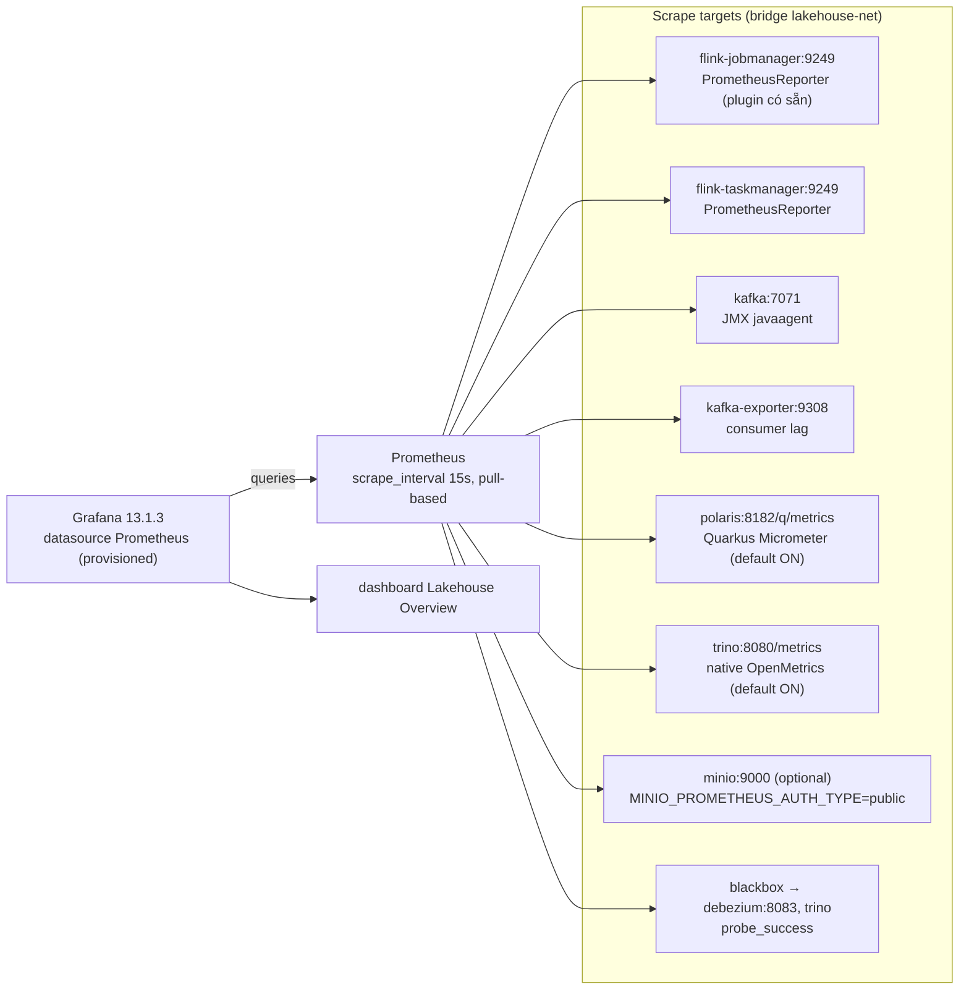

# Monitoring — Prometheus + Grafana (thiết kế)

Giám sát toàn luồng stream CDC: phát hiện stream rớt / checkpoint fail / lag / broker yếu —
bổ trợ cho `scripts/watchdog.sh` (watchdog = **recovery actuator**, monitoring = **detection +
visibility**). Core: **Prometheus + Grafana**, scrape pull-based. Tất cả giá trị version & endpoint
dưới đây đã **verify thực nghiệm trên stack hiện tại** (không chỉ là tài liệu).

## 1. Versions (đã verify, 2026-08)

| Component | Image / artifact | Version | Ghi chú |
|-----------|------------------|---------|---------|
| Prometheus | `prom/prometheus` | `v3.13.2` | chạy UID 65534 |
| Grafana OSS | `grafana/grafana` | `13.1.3` | chạy UID 472; **dùng `grafana/grafana`, KHÔNG `grafana-oss`** (repo đó đóng băng ở 12.4) |
| Blackbox exporter | `prom/blackbox-exporter` | `v0.28.0` | tùy chọn, probe up/down REST |
| Alertmanager | `prom/alertmanager` | `v0.33.0` | **bỏ qua lúc này** (chỉ cần khi có alert outbound email/slack/webhook); thêm sau không đụng scrape config |
| Kafka JMX exporter | `jmx_prometheus_javaagent` | `1.6.0` | tải từ GitHub Releases |
| Kafka consumer lag | `danielqsj/kafka-exporter` | `latest` (v1.9.0) | đọc `__consumer_offsets`, scrape port 9308 |
| Flink reporter | `flink-metrics-prometheus-2.1.2.jar` | có sẵn trong image | **chỉ cần config, không cần jar** (verify) |

## 2. Kiến trúc scrape



**Quy tắc network:** Prometheus chạy cùng bridge `lakehouse-net` → scrape theo **service name**
(`flink-jobmanager:9249`, `kafka:7071`, …), KHÔNG phải `localhost`. Chỉ self-scrape của Prometheus
mới dùng `localhost:9090`.

## 3. Trạng thái từng endpoint (đã test trên stack thật)

| Endpoint | Port | Trạng thái | Bằng chứng |
|----------|------|-----------|------------|
| Flink JM reporter | `flink-jobmanager:9249/metrics` | ✅ **chỉ config, không cần jar** | chạy thử jobmanager tạm → scrape được `flink_jobmanager_numRegisteredTaskManagers`, `flink_jobmanager_Status_JVM_*` |
| Polaris | `polaris:8182/q/metrics` | ✅ **mở sẵn, default ON** | `curl :8182/q/metrics` → HTTP 200, 363 metric (`worker_pool_active`, `http_server_requests_seconds_bucket`) |
| Trino | `trino:8080/metrics` | ✅ **native OpenMetrics, default ON** | `curl :8080/metrics` → HTTP 200, ~874KB, có `trino_execution_name_QueryManager_{Running,Queued,Failed}Queries` |
| Kafka broker | `kafka:7071/metrics` | ⏳ cần lắp javaagent (KAFKA_OPTS) | thiết kế dưới |
| Consumer lag | `kafka-exporter:9308/metrics` | ⏳ cần service mới | thiết kế dưới |
| MinIO (optional) | `minio:9000/minio/v2/metrics/cluster` | ⚠️ 403 mặc định | cần `MINIO_PROMETHEUS_AUTH_TYPE=public` hoặc bearer token |
| Debezium/Connect | REST `:8083` | cron/script + blackbox | `watchdog.sh` đã check `.connector.state==RUNNING` |

## 4. Thay đổi trên stack hiện tại (tối thiểu)

### 4.1 Flink — bật reporter (KHÔNG cần jar, đã verify)
Thêm 2 dòng vào `FLINK_PROPERTIES` của **cả `flink-jobmanager` và `flink-taskmanager`** trong
`docker-compose.yml`:

```yaml
    environment:
      FLINK_PROPERTIES: |
        jobmanager.rpc.address: flink-jobmanager
        # ...giữ nguyên các dòng hiện có...
        metrics.reporter.prom.factory.class: org.apache.flink.metrics.prometheus.PrometheusReporterFactory
        metrics.reporter.prom.port: 9249
```

- Cần `docker compose up -d flink-jobmanager flink-taskmanager` (restart JM/TM để reporter load).
- JM và TM mỗi tiến trình bind port 9249 trong container riêng → **không publish ra host**,
  Prometheus scrape trên network bằng service name, không xung đột port.
- Không cần `metrics.reporter.prom.interval` (pull-based).
- Bug FLINK-38704 (bỏ qua port tùy chỉnh) đã fix ở 2.1.2 → `port: 9249` dạng số OK.

**Metric names quan trọng (Flink 2.1.x):**

| Ý nghĩa | Metric | Kiểu |
|---------|--------|------|
| Job đang chạy | `flink_jobmanager_job_runningTime` | gauge (ms) |
| Checkpoint completed | `flink_jobmanager_job_numberOfCompletedCheckpoints` | gauge |
| Checkpoint failed | `flink_jobmanager_job_numberOfFailedCheckpoints` | gauge |
| Duration checkpoint gần nhất | `flink_jobmanager_job_lastCheckpointDuration` | gauge (ms) |
| Số lần restart | `flink_jobmanager_job_numRestarts` | gauge |
| Records/sec in/out | `flink_taskmanager_job_task_operator_numRecordsInPerSecond` / `..._numRecordsOutPerSecond` | gauge |
| Backpressure | `flink_taskmanager_job_task_backPressuredTimeMsPerSecond` | gauge |

### 4.2 Kafka — JMX exporter javaagent + kafka_exporter

1. Tải javaagent vào project:
   ```bash
   mkdir -p monitoring/kafka
   curl -fL -o monitoring/kafka/jmx_prometheus_javaagent-1.6.0.jar \
     https://github.com/prometheus/jmx_exporter/releases/download/1.6.0/jmx_prometheus_javaagent-1.6.0.jar
   ```
2. `monitoring/kafka/jmx-kafka.yml` — config tối giản (dựa trên official
   `examples/kafka-kraft-3_0_0.yml`, áp dụng cho Kafka 4.x):
   ```yaml
   lowercaseOutputName: true
   rules:
     - pattern: "kafka.server<type=ReplicaManager, name=UnderReplicatedPartitions><>Value"
       name: kafka_server_replicamanager_underreplicatedpartitions
       type: GAUGE
     - pattern: "kafka.server<type=ReplicaManager, name=OfflineReplicaCount><>Value"
       name: kafka_server_replicamanager_offlinereplicacount
       type: GAUGE
     - pattern: "kafka.controller<type=KafkaController, name=ActiveControllerCount><>Value"
       name: kafka_controller_kafkacontroller_activecontrollercount
       type: GAUGE
     - pattern: "kafka.server<type=BrokerTopicMetrics, name=BytesInPerSec><>Count"
       name: kafka_server_brokertopicmetrics_bytesin_total
       type: COUNTER
     - pattern: "kafka.server<type=BrokerTopicMetrics, name=BytesOutPerSec><>Count"
       name: kafka_server_brokertopicmetrics_bytesout_total
       type: COUNTER
   ```
   (javaagent 1.6.0 tự expose `jvm_*`, `process_cpu_*` không cần rule.)
3. Sửa service `kafka` trong compose — gắn agent qua `KAFKA_OPTS` (image apache/kafka đọc
   `$KAFKA_OPTS`, KHÔNG phải `KAFKA_JMX_OPTS`), mount jar+yml read-only (file 644, user appuser):
   ```yaml
   kafka:
     ports:
       - "9092:9092"
       - "7071:7071"            # JMX exporter
     environment:
       KAFKA_OPTS: "-javaagent:/opt/kafka/jmx_exporter/jmx_prometheus_javaagent-1.6.0.jar=7071:/opt/kafka/jmx_exporter/jmx-kafka.yml"
     volumes:
       - ./monitoring/kafka:/opt/kafka/jmx_exporter:ro
   ```
4. **Consumer lag** — broker KHÔNG tính lag server-side; thêm service `kafka-exporter` (đọc
   `__consumer_offsets`, no ZK):
   ```yaml
   kafka-exporter:
     image: danielqsj/kafka-exporter:latest
     container_name: lakehouse-kafka-exporter
     depends_on:
       kafka: { condition: service_healthy }
     command:
       - --kafka.server=kafka:9092
       - --group.filter=flink-lakehouse
       - --offset.show-all=true
       - --web.listen-address=:9308
     ports:
       - "9308:9308"
     networks: [lakehouse-net]
   ```
   Metric: `kafka_consumergroup_lag{consumergroup="flink-lakehouse",topic=...,partition=...}`,
   `kafka_consumergroup_lag_sum`. Nếu gặp lỗi protocol-version trên Kafka 4.3.1, thêm
   `--kafka.version=4.3.1`.

### 4.3 Polaris / Trino / MinIO — không cần đổi gì
- Polaris `/q/metrics` mở sẵn (management port 8182). Tùy chọn: đặt SLO histogram latency —
  `POLARIS_METRICS_HTTP_SERVER_REQUESTS_HISTOGRAM_SLOS=10ms,50ms,100ms,1s,5s`.
- Trino `/metrics` native, default ON. Vì output ~874KB/cardinality cao, thêm filter trong
  `trino/etc/config.properties` (optional):
  `openmetrics.jmx-object-names=trino.execution:name=QueryManager,trino.memory:*,java.lang:type=Memory,*`
- MinIO (optional): `MINIO_PROMETHEUS_AUTH_TYPE=public` trong service `minio` → scrape
  `minio:9000/minio/v2/metrics/cluster`.

### 4.4 Debezium/Connect — status check
- **Deep connector state**: script có sẵn (`watchdog.sh` guard đã check `.connector.state==RUNNING`,
  `curl :8083/connectors/postgres-connector/status`). Nếu muốn script độc lập chạy cron, tách
  thành `scripts/connect-health.sh` trả exit code.
- **Up/down signal** cho dashboard + alert: blackbox exporter (xem 5.3).

## 5. Services monitoring (thêm vào docker-compose.yml)

### 5.1 Prometheus + Grafana
```yaml
  prometheus:
    image: prom/prometheus:v3.13.2
    container_name: lakehouse-prometheus
    restart: unless-stopped
    command:
      - --config.file=/etc/prometheus/prometheus.yml
      - --storage.tsdb.path=/prometheus
    ports:
      - "9090:9090"
    volumes:
      - ./monitoring/prometheus/prometheus.yml:/etc/prometheus/prometheus.yml:ro
      - ./monitoring/prometheus/data:/prometheus
    networks: [lakehouse-net]

  grafana:
    image: grafana/grafana:13.1.3
    container_name: lakehouse-grafana
    restart: unless-stopped
    environment:
      - GF_SECURITY_ADMIN_USER=admin
      - GF_SECURITY_ADMIN_PASSWORD=${GRAFANA_ADMIN_PASSWORD:-admin}
    ports:
      - "3000:3000"
    volumes:
      - ./monitoring/grafana/provisioning:/etc/grafana/provisioning:ro
      - ./monitoring/grafana/dashboards:/var/lib/grafana/dashboards:ro
      - ./monitoring/grafana/data:/var/lib/grafana
    networks: [lakehouse-net]

  blackbox-exporter:
    image: prom/blackbox-exporter:v0.28.0
    container_name: lakehouse-blackbox
    restart: unless-stopped
    command: ["--config.file=/etc/blackbox_exporter/blackbox.yml"]
    ports:
      - "9115:9115"
    volumes:
      - ./monitoring/blackbox/blackbox.yml:/etc/blackbox_exporter/blackbox.yml:ro
    networks: [lakehouse-net]
```

**Chuẩn bị thư mục + quyền (bắt buộc trước khi up):**
```bash
mkdir -p monitoring/{prometheus/data,grafana/{data,provisioning/{datasources,dashboards},dashboards},blackbox}
sudo chown -R 65534:65534 monitoring/prometheus/data    # Prometheus UID
sudo chown -R 472:472     monitoring/grafana/data       # Grafana UID
chmod o+r monitoring/**/*.yml monitoring/**/*.json      # config mounted ro cần world-readable
```

### 5.2 prometheus.yml
```yaml
global:
  scrape_interval: 15s
  evaluation_interval: 15s

scrape_configs:
  - job_name: prometheus
    static_configs: [{ targets: ["localhost:9090"] }]

  - job_name: flink-jobmanager
    static_configs: [{ targets: ["flink-jobmanager:9249"] }]

  - job_name: flink-taskmanager
    static_configs: [{ targets: ["flink-taskmanager:9249"] }]

  - job_name: kafka
    static_configs: [{ targets: ["kafka:7071"] }]

  - job_name: kafka-consumer-lag
    static_configs: [{ targets: ["kafka-exporter:9308"] }]

  - job_name: polaris
    metrics_path: /q/metrics              # KHÔNG phải /metrics (bỏ từ 1.3.0)
    static_configs: [{ targets: ["polaris:8182"] }]

  - job_name: trino
    metrics_path: /metrics
    static_configs: [{ targets: ["trino:8080"] }]
    metric_relabel_configs:               # /metrics ~874KB; bỏ series fine-grained
      - source_labels: [__name__]
        regex: '.*_(FifteenMinute|FiveMinute|OneMinute)_.*'
        action: drop
      - source_labels: [__name__]
        regex: '.*io_airlift_http_client.*'
        action: drop

  # (optional) MinIO
  # - job_name: minio
  #   metrics_path: /minio/v2/metrics/cluster
  #   static_configs: [{ targets: ["minio:9000"] }]

  # Up/down signal cho REST-only (Connect, Trino) — probe_success
  - job_name: blackbox
    metrics_path: /probe
    params: { module: [http_2xx] }
    static_configs:
      - targets:
          - http://debezium:8083/connectors
          - http://trino:8080/v1/info
    relabel_configs:
      - source_labels: [__address__]
        target_label: __param_target
      - source_labels: [__param_target]
        target_label: instance
      - target_label: __address__
        replacement: blackbox-exporter:9115
```

### 5.3 blackbox.yml
```yaml
modules:
  http_2xx:
    prober: http
    http:
      preferred_ip_protocol: ip4
```

### 5.4 Grafana provisioning
`monitoring/grafana/provisioning/datasources/prometheus.yml`:
```yaml
apiVersion: 1
datasources:
  - name: Prometheus
    type: prometheus
    access: proxy
    url: http://prometheus:9090
    uid: prometheus-main
    isDefault: true
    editable: false
```
`monitoring/grafana/provisioning/dashboards/lakehouse.yml`:
```yaml
apiVersion: 1
providers:
  - name: Lakehouse
    orgId: 1
    folder: ""
    type: file
    disableDeletion: false
    updateIntervalSeconds: 30
    allowUiUpdates: false
    options:
      path: /var/lib/grafana/dashboards
```
Dashboard JSON đặt tại `monitoring/grafana/dashboards/lakehouse.json` (datasource uid
`prometheus-main` phải khớp file datasource).

## 6. Dashboard "Lakehouse Overview" (panels tối thiểu)

| Row | Panel | Query |
|-----|-------|-------|
| Service | Flink JM / TM up | `up{job="flink-jobmanager"}` / `{job="flink-taskmanager"}` |
| | Kafka broker up | `up{job="kafka"}` |
| | Polaris / Trino / Connect up | `up{job="polaris"}` / `up{job="trino"}` / `probe_success{instance="http://debezium:8083/connectors"}` |
| Pipeline | Records/sec (in/out) | `sum by (job)(rate(flink_taskmanager_job_task_operator_numRecordsInPerSecond[1m]))` |
| | Backpressure | `flink_taskmanager_job_task_backPressuredTimeMsPerSecond` |
| Checkpoint | Completed / Failed | `flink_jobmanager_job_numberOfCompletedCheckpoints`, `..._numberOfFailedCheckpoints` |
| | Duration | `flink_jobmanager_job_lastCheckpointDuration` |
| | Restarts | `flink_jobmanager_job_numRestarts` |
| Kafka | Under-replicated | `kafka_server_replicamanager_underreplicatedpartitions` |
| | Consumer lag | `sum(kafka_consumergroup_lag{consumergroup="flink-lakehouse"})` |
| Polaris | REST request latency | `histogram_quantile(0.99, sum(rate(http_server_requests_seconds_bucket[5m])) by (le,uri))` |
| Trino | Running/Queued/Failed queries | `trino_execution_name_QueryManager_RunningQueries` (…`QueuedQueries`, `FailedQueries`) |

## 7. Alert rules (gắn cùng watchdog)

Mục tiêu: alert phát hiện **trước khi** lỗi leo thang; watchdog là **hành động chữa** (chạy
snapshot → reconcile → restart từ latest). Vì alert kéo dài tương đương 1-2 khoảng checkpoint
stall, rule nên trigger sớm hơn `MAX_STREAM_STALL` (300s) hoặc bằng nó.

```yaml
groups:
  - name: lakehouse-stream
    rules:
      - alert: FlinkJobmanagerDown
        expr: up{job="flink-jobmanager"} == 0
        for: 2m
        annotations: { summary: "Flink JobManager down" }

      - alert: FlinkCheckpointFailing
        expr: increase(flink_jobmanager_job_numberOfFailedCheckpoints[5m]) > 0
        for: 2m
        annotations: { summary: "Checkpoint fail — stream có thể phải backfill (watchdog sẽ xử lý)" }

      - alert: StreamStalled
        expr: sum(flink_taskmanager_job_task_operator_numRecordsInPerSecond) == 0
          and (time() - process_start_time_seconds{job="flink-jobmanager"}) > 600
        for: 10m
        annotations: { summary: "Stream không consume record trong 10m" }

      - alert: KafkaUnderReplicated
        expr: kafka_server_replicamanager_underreplicatedpartitions > 0
        for: 5m
        annotations: { summary: "Kafka có partition under-replicated" }

      - alert: KafkaConsumerLag
        expr: sum(kafka_consumergroup_lag{consumergroup="flink-lakehouse"}) > 10000
        for: 5m
        annotations: { summary: "Consumer lag flink-lakehouse quá cao" }

      - alert: ConnectUnreachable
        expr: probe_success{instance="http://debezium:8083/connectors"} == 0
        for: 2m
        annotations: { summary: "Kafka Connect REST không reachable" }

      - alert: PolarisDown
        expr: up{job="polaris"} == 0
        for: 2m
```

**Nối alert → watchdog (tùy chọn):** webhook receiver gọi
`scripts/watchdog.sh` khi alert `FlinkCheckpointFailing` / `StreamStalled` fire. Cách đơn giản
nhất: giữ cron watchdog `*/5 * * * *` như hiện tại (tự phát hiện + tự chữa), alert chỉ thông báo
con người — tránh chồng lấn 2 cơ chế tự chữa.

## 8. Gotchas

- **UID bind-mount**: Prometheus 65534, Grafana 472 — chown data dir trước, không là container fail.
- **Polaris scrape port 8182** (management), KHÔNG 8181 — trap y hệt `s3.*` namespace.
- **Trino `/metrics`** là native OpenMetrics (v407+), KHÔNG cần JMX exporter; output lớn → relabel.
  Trino 483 **guard `/metrics` bằng identity signal**: dù chạy `insecure` (không validate), nó vẫn trả
  **401** nếu thiếu `Authorization: Basic` hoặc header `X-Trino-User`. Prometheus không gửi được header
  tuỳ ý → dùng `basic_auth` với username bất kỳ, password rỗng (`username: prometheus`, `password: ""`).
- **Kafka**: gắn agent bằng `KAFKA_OPTS` (image apache/kafka), mount jar 644; agent bind `0.0.0.0:7071`.
- **Kafka `KAFKA_OPTS` làm hỏng healthcheck mặc định**: `kafka-broker-api-versions.sh` (và mọi CLI
  `kafka-*.sh`) inherit `KAFKA_OPTS` → javaagent thử bind `:7071` lần 2 (broker đã giữ) → `BindException`
  → script exit ≠ 0 → container bị đánh "unhealthy". Fix: healthcheck dùng `nc -z localhost 9092`;
  khi chạy CLI trong container phải `env KAFKA_OPTS= /opt/kafka/bin/kafka-....sh`.
- **Kafka KHÔNG persist data mặc định** (bug nghiêm trọng, monitoring bắt được): image apache/kafka
  default `log.dirs` = `/tmp/kafka-logs` (ephemeral). Mount `./kafka/data:/mnt/kafka-logs` mà KHÔNG set
  `KAFKA_LOG_DIRS=/mnt/kafka-logs` thì mỗi lần recreate container là **mất toàn bộ topic**. Khi đó group
  offset (Flink) vẫn sống → **lag âm** (`kafka_consumergroup_lag` < 0) vì committed offset > log-end.
  Cảnh báo sớm nhất chính là alert consumer-lag; nếu lag âm → topic đã bị truncate/reset.
- **Kafka trên 9p (WSL2 `/mnt/d`)**: log dir bind-mount tới `./kafka/data` có thể fail rename/fsync
  (IOException → "failed log directory" → broker tự shutdown). Đây là giới hạn của 9p, không phải lỗi
  config. Khắc phục nhanh: `rm -rf ./kafka/data && mkdir -p ./kafka/data && chmod 777 ./kafka/data` rồi
  recreate. (Named volume ext4 bền vững hơn nhưng tạm không dùng theo convention project.)
- **Connect internal topics cần `cleanup.policy=compact`**: `connect-offsets` / `connect-configs` /
  `connect-status` nếu bị Kafka auto-create (`auto.create.topics.enable=true`) sẽ có policy `delete` →
  Connect từ chối start ("required to have cleanup.policy=compact"). Fix: pre-create 3 topic với
  `--config cleanup.policy=compact` (25/1/5 partitions) trước khi start Connect; hoặc tắt auto-create
  để Connect tự tạo đúng policy.
- **kafka-exporter flag boolean**: dùng bare `--offset.show-all` (kingpin `--[no-]...`), KHÔNG
  `--offset.show-all=true` (bị báo "unexpected true").
- **Consumer lag** không đọc từ broker — phải `kafka_exporter` (đọc `__consumer_offsets`).
- **Flink reporter**: không cần copy jar (plugin `plugins/metrics-prometheus` tự load — đã verify);
  restart JM/TM sau khi thêm config.
- **MinIO metrics** 403 mặc định → cần `MINIO_PROMETHEUS_AUTH_TYPE=public` hoặc bearer token.
- Alertmanager chưa cần; thêm sau khi có nhu cầu outbound.

## 9. Các bước implement (khi duyệt)

1. `mkdir -p monitoring/...` + chown (mục 5.1).
2. Tải `jmx_prometheus_javaagent-1.6.0.jar`, viết `monitoring/kafka/jmx-kafka.yml`.
3. Sửa `docker-compose.yml`: thêm `metrics.reporter.prom.*` vào FLINK_PROPERTIES (JM+TM), sửa
   service `kafka` (KAFKA_OPTS + port 7071 + mount), thêm services `prometheus`, `grafana`,
   `kafka-exporter`, `blackbox-exporter`.
4. Viết `monitoring/prometheus/prometheus.yml` + `monitoring/grafana/provisioning/**` +
   `monitoring/grafana/dashboards/lakehouse.json`.
5. `docker compose up -d --build prometheus grafana kafka-exporter blackbox-exporter`
   → `docker compose up -d flink-jobmanager flink-taskmanager kafka` (restart bật reporter/agent).
6. Verify scrape targets trong Prometheus UI (`localhost:9090/targets`) + dashboard Grafana
   (`localhost:3000`).
